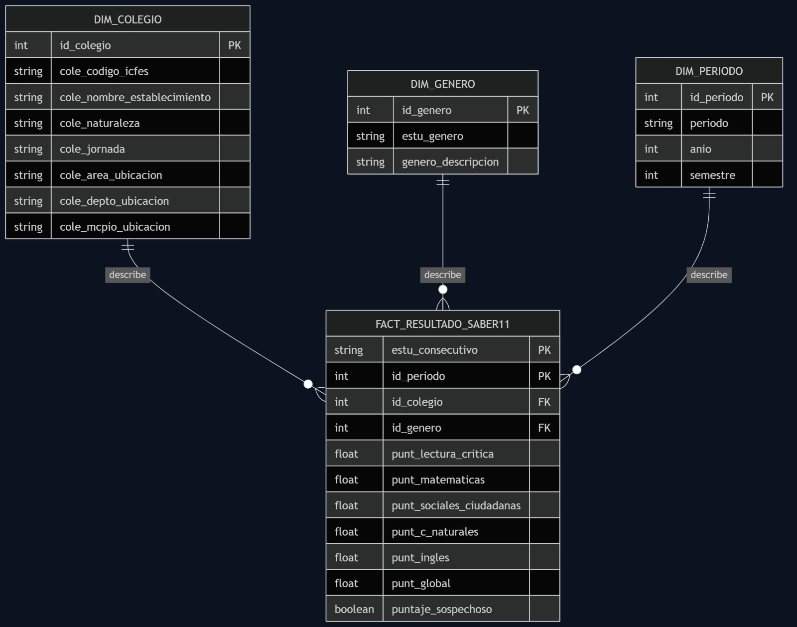
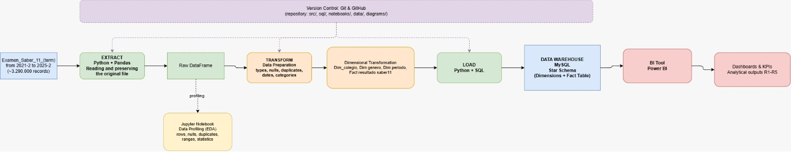
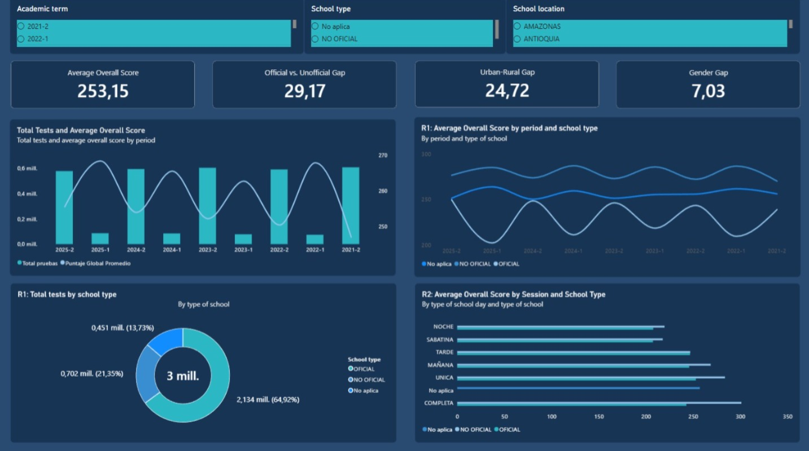
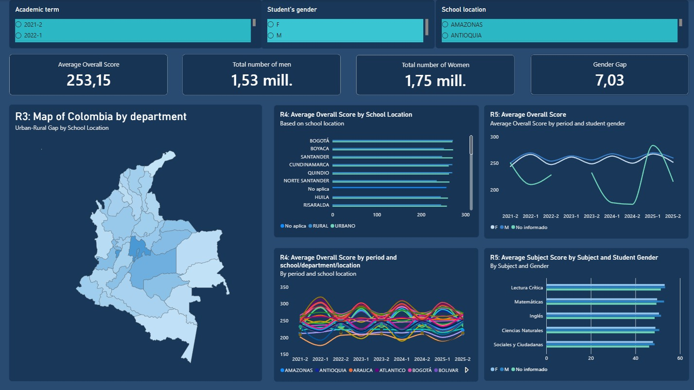

# ETL Project. Data Engineering for Sustainable Development in Colombia

## 1. Colombian Problem Definition

**Selected SDG:** SDG 4. Quality Education.

**Relevant SDG targets:**
- **4.1:** Ensure all girls and boys complete free, equitable and quality primary and secondary education, leading to relevant and effective learning outcomes.
- **4.5:** Eliminate disparities in access to education, particularly for the vulnerable, including geographic disparities.

**Colombian context and evidence:**
Colombia has persistent differences in educational outcomes across geographic areas, school sectors, school shifts, and student groups. These differences are relevant when examining access to educational opportunities and learning conditions across official and non-official schools, urban and rural areas, departments, and genders.

The Saber 11 assessment provides standardized information that can be used to observe these differences at the national level. By analyzing assessment periods from 2021-2 to 2025-2, this project examines how academic performance varies across these contexts and whether the observed gaps change over time.

This evidence shows a longitudinal analysis of educational inequality in Colombia. Rather than measuring educational investment directly, the project uses school, geographic, and student characteristics as contextual indicators associated with differences in academic performance. The analysis therefore provides an indirect perspective on equity in education and its evolution over time, in relation to the objectives of Sustainable Development Goal 4 (SDG 4).

**Geographic scope:** National, with departmental-level disaggregation (32 departments + Bogotá D.C.).

**Population / phenomenon of interest:** Students who took the Saber 11 exam between 2021-2 and 2025-2 (~3.29 million exam attempts), across official and non-official schools nationwide.

**Precise problem statement:**
Are there systematic differences in Colombian students' performance on the Saber 11 exam (2021-2 to 2025-2) associated with indicators of educational resources/investment, school type (official/non-official), school shift, urban/rural location, and department, and how has that gap evolved over time, as an indirect indicator of Colombia's progress toward SDG 4?

**Stakeholders / potential users:** Ministry of National Education (MEN), ICFES, departmental/municipal departments of education, DNP, school administrators and staff, education-policy researchers.

**Relevance for decision-making:** Helps with providing evidence that can support education policy and planning by identifying where performance gaps are observed across school sectors, school shifts, urban and rural areas, departments, and gender. The longitudinal analysis from 2021-2 to 2025-2 to distinguish persistent disparities from changes over time.

The results can help identify geographic and population groups where further investigation, monitoring, or targeted educational interventions may be warranted.

The project also provides a repeatable analytical framework for monitoring these disparities over time. In the context of SDG 4, the resulting indicators can be used as an indirect measure of progress toward more equitable and inclusive educational outcomes in Colombia.

---

## 2. Analytical Objective and Requirements

**Analytical objective:** Analyze the relationship between educational-resource/investment indicators observable in the Saber 11 microdata (school type, shift, location, department, and student gender) and the academic performance of Colombian 11th-grade students between 2021-2 and 2025-2, to support SDG 4 monitoring in Colombia at the departmental level.

### Requirements

| ID | Analytical Requirement | Business Question | Decision / Insight Supported |
|---|---|---|---|
| R1 | Performance gap between official and non-official schools, and its evolution 2021-2 to 2025-2 | What is the difference in average global score between official and non-official schools, and has it widened or narrowed over time? | Prioritize investment/resources toward official schools if the gap persists or grows |
| R2 | Effect of school shift (jornada) on performance, controlling for school type and area | Do students in single-shift/full-day schools score differently than other shifts, and does that difference hold within the same school type and area? | Assess whether expanding single-shift/full-day programs (which requires infrastructure/staffing investment) is an effective lever |
| R3 | Urban-rural gap by department | How does average score vary between urban and rural schools, and in which departments is the gap largest? | Target rural infrastructure/connectivity programs at the departments with the largest urban-rural gap |
| R4 | Departmental disparity and its evolution 2021-2 to 2025-2 | Which departments show the highest/lowest average performance, and how has that ranking changed across the 9 periods? | Support sustained territorial targeting of MEN/DNP resources |
| R5 | Gender gap in performance (global and by subject), and its evolution | Is there a systematic score difference between male and female students, and does it hold or change over time? | Inform gender-differentiated pedagogical strategies (e.g., in STEM areas) |

---

## 3. SDG Alignment

- **Target 4.1** (effective learning outcomes) supports all five requirements. Saber 11 is Colombia's standardized measure of learning outcomes at the end of secondary education.

- **Target 4.5** (eliminate disparities) is directly supported by R1 (school type), R3 (urban/rural), R4 (department) and R5 (gender) four different dimensions of educational disparity.

---

## 4. Data Source Selection

**Source:** ICFES (Instituto Colombiano para la Evaluación de la Educación), an agency attached to the Ministry of National Education, via its DataIcfes open-data portal.
**Access:** `https://www.icfes.gov.co/investigaciones/data-icfes/` registration required; files are delivered as one flat file per academic period.
**Format as delivered:** plain `.txt` files, `;`-delimited, UTF-8 encoded, named `Examen_Saber_11_{period_without_dash}.txt` (e.g. `Examen_Saber_11_20212.txt`).
**Coverage used in this delivery:** 9 semester periods, **2021-2 through 2025-2**

---

## 5. Dataset Suitability Assessment

### Dataset Suitability Matrix

| Criterion | Assessment |
|---|---|
| **Institution / Data Owner** | ICFES. Instituto Colombiano para la Evaluación de la Educación, attached to the Ministry of National Education |
| **Source URL / Access Mechanism** | DataIcfes portal (icfes.gov.co/investigaciones/data-icfes); registration + FTP-style download |
| **Format** | Flat .txt files, ;-delimited, UTF-8; one file per academic period |
| **Number of Records** | 3,287,055 raw records across the 9 periods |
| **Number of Attributes** | 84-85 in most individual periods; 92 in 2025-2 |
| **Geographic Coverage** | National, 32 departments + Bogotá D.C., down to municipality and school |
| **Temporal Coverage** | 9 semester periods, 2021-2 to 2025-2 (4 years) |
| **Relevant Numerical Measures** | `punt_lectura_critica`, `punt_matematicas`, `punt_sociales_ciudadanas`, `punt_c_naturales`, `punt_ingles`, `punt_global` |
| **Relevant Categorical Attributes** | `cole_naturaleza`, `cole_jornada`, `cole_area_ubicacion`, `cole_depto_ubicacion`/`cole_mcpio_ubicacion`, `estu_genero`, `cole_calendario`, `cole_bilingue`, `cole_caracter` |
| **Potential Data-Quality Issues** | Schema changes across periods (columns added/removed); columns with similar names but with different types of data; records with punt_global = 0. |
| **Relationship with Analytical Requirements** | Directly supports R1 (naturaleza), R2 (jornada), R3 (area), R4 (department + period), R5 (gender) every variable needed is already in this datasets |
| **Suitability for Dimensional Modeling** | High: the categorical variables are already pre-normalized in the source (department, municipality, school, shift, naturaleza), mapping cleanly onto dimensions, with the punt_* columns as fact-table measures |
| **Unit of Observation in the Source** | One record: one student's Saber 11 exam attempt in a specific period/calendar |

---

## 6. Data Profiling and Quality Assessment

Profiling was performed in notebooks/data_profiling.ipynb, with additional targeted checks run interactively during development. All figures below are from the real, complete dataset (all 9 periods).

**Records and attributes:** 3,287,055 raw records; harmonized master schema of 92 columns.

**Schema evolution across periods (etl_schema_control table in the notebook):**

| Period | Columns | Status |
|---|---|---|
| 2021-2 | 85 | OK (baseline) |
| 2022-1 | 84 | CHANGE (estu_generacione dropped) |
| 2022-2 | 84 | OK |
| 2023-1 | 84 | OK |
| 2023-2 | 84 | CHANGE (estu_grupoetnia added, estu_tieneetnia dropped) |
| 2024-1 | 85 | CHANGE (estu_tieneetnia returns) |
| 2024-2 | 85 | OK |
| 2025-1 | 85 | OK |
| 2025-2 | 92 | CHANGE (7 new columns) |

**Missing values and duplicate records:**
- estu_consecutivo (the natural exam-attempt identifier): 2 exact duplicates, both in period 2025-2; 0 in every other period.
- estu_genero: 141 nulls out of ~3.29M (0.004%).
- cole_naturaleza, `cole_jornada`, `cole_area_ubicacion`, `cole_depto_ubicacion`: 451,150 nulls each (13.73%) and it is the same records missing all four simultaneously (confirmed via a 100% overlap check against `cole_nombre_establecimiento`, which is also null on those rows). It shows us that this is not a data-entry error: it corresponds to students with no associated school (external "validante" candidates, plus a small number of incarcerated candidates flagged via `estu_privado_libertad`).

**Unique values / cardinality:** `cole_naturaleza` (2 real values), `cole_jornada` (6), `estu_genero` (2, plus the small null residual), departments (33), `cole_area_ubicacion` (2 real values, but 3 distinct strings before harmonization).

**Invalid / inconsistent / suspicious values:**
- `cole_area_ubicacion` contains `"URBANO"` (1,452,026 rows) and `"URBANA"` (902,986 rows) as two separate string values for the same category, alongside `"RURAL"` (480,893) and the 451,150 nulls listed above.
- `punt_global = 0` in 28 records. Implausible for a real, completed attempt; almost certainly annulled/absent exams rather than genuine measurements.
- All `punt_global` values fall inside the valid ICFES range of [0, 500] no out-of-range values found.

---

## 7. Requirements-to-Data Traceability

| Requirement | Required Attributes | Transformation Needed | Expected KPI / Analysis |
|---|---|---|---|
| R1 | `cole_naturaleza`, `punt_global`, `periodo` | Group by naturaleza × period; compute mean and gap | Global-score gap, official vs. non-official, trend by period |
| R2 | `cole_jornada`, `cole_naturaleza`, `cole_area_ubicacion`, `punt_global` | Harmonize shift categories; group by shift, controlling for naturaleza/area | Average global score by shift (controlled) |
| R3 | `cole_area_ubicacion`, `cole_depto_ubicacion`, `punt_global` | Harmonize `"URBANA"`/`"URBANO"`; group by department × area | Urban-rural gap by department, ranked |
| R4 | `cole_depto_ubicacion`, `punt_global`, `periodo` | Group by department × period; rank and track changes | Departmental ranking of average global score, by period |
| R5 | `estu_genero`, `punt_global` (and by-area `punt_*`), `periodo` | Drop the 0.004% of records missing `estu_genero`; group by gender × period (and by area) | Gender gap in global and by-area scores, trend by period |

---

## 8. Data Preparation Strategy

### Type conversion
`punt_*` columns are cast to numeric; categorical fields become low-cardinality strings; `periodo` is standardized to the canonical `AAAA-S` format, overwriting the source file's own integer code. so there is a single, consistent representation of the period across the whole warehouse.

### Missing-value handling
Two genuinely different situations, handled two different ways:

- **`estu_genero` (0.004% missing):** the affected rows are dropped **only from the R5 (gender) analysis** a gender comparison has no group to assign a null-gender row to, and the volume is too small to affect any aggregate. Rows are not deleted from the fact table.
- **`cole_naturaleza` / `cole_jornada` / `cole_area_ubicacion` / `cole_depto_ubicacion` (13.73% missing, all on the same "no school" rows):** these rows are not dropped. At 13.7% of the whole dataset, deleting them would silently shrink the population for every other requirement too, and the missingness is not random, it corresponds to a real, meaningful subgroup (validantes). The dimensional model instead gives every affected dimension an explicit id = -1 "not applicable" member: the fact row is loaded like any other, tagged with that member, and it is up to each specific query whether to include it.

### Duplicate analysis and treatment
Duplicate analysis is performed using `estu_consecutivo` within each assessment period, rather than full-row equality.
Duplicates are removed in two stages: first, duplicates within each processing chunk are dropped. Second, records whose `estu_consecutivo` was already seen in a previous chunk of the same period are removed.

This treatment prevents multiple fact records from representing the same exam attempt and avoids relying on the database to silently discard duplicates. The resulting row counts therefore reflect the records that are actually eligible for loading into the fact table.

### Categorical harmonization
`cole_area_ubicacion`: the source values `"URBANA"` and `"URBANO"` are mapped to the canonical value `"URBANO"`, while `"RURAL"` is preserved as it is. This prevents the same urban category from being represented by multiple labels during aggregation and comparison.

### Handling invalid values
The 28 records with `punt_global = 0` are flagged, not deleted (`puntaje_sospechoso = TRUE`). They stay in the fact table for auditability but should be excluded from performance-focused KPI calculations, since a literal zero score does not reflect real learning outcomes and it's most likely an annulled/absent test.

### Derived attributes
None are created. Every current requirement (R1-R5) is directly computable from columns that already exist in the source.

---

## 9. Declare the Grain

One row in Fact_ResultadoSaber11 represents one student's Saber 11 exam attempt, in one academic period, together with the scores obtained in each evaluated area and the school/student attributes known at the moment of that attempt. 

**Business process represented:** A student takes the Saber 11 assessment during a defined examination period, ICFES records and publishes the assessment results, each student-level result represents an exam outcome associated with a period and school/student context.

a student takes the Saber 11 exam → ICFES publishes the period's results as an open dataset → this pipeline extracts, cleans and loads them into a dimensional Data Warehouse → analysts and decision-makers query that warehouse to monitor performance gaps tied to SDG 4.

---

## 10. Star Schema

**Design:** 1 fact table + 3 dimensions.



### Dimensions

| Dimension | Purpose | Main Attributes | Requirement(s) Supported |
|---|---|---|---|
| **Dim_Colegio** | Enables analysis of performance by school sector, school shift, urban/rural location, and department. | `id_colegio` (PK, surrogate), `cole_codigo_icfes` (UK), `cole_nombre_establecimiento`, `cole_naturaleza`, `cole_jornada`, `cole_area_ubicacion` (harmonized), `cole_depto_ubicacion`, `cole_mcpio_ubicacion` | R1, R2, R3, R4 |
| **Dim_Genero** | Enables comparison of academic performance by gender. | `id_genero` (PK, surrogate), `estu_genero`, `genero_descripcion` | R5 |
| **Dim_Periodo** | Provides the time axis for longitudinal analysis across the nine Saber 11 assessment periods. | `id_periodo` (PK, surrogate), `periodo` (canonical `AAAA-S`), `anio`, `semestre` | R1, R2, R4, R5 |

---

## 11. Requirements-to-Model Validation

| Requirement | Dimension(s) | Measure(s) | Expected Query/KPI | Supported? |
|---|---|---|---|---|
| R1 | Dim_Colegio (`cole_naturaleza`), Dim_Periodo | `punt_global` (avg) | Official vs. non-official gap, by period | Yes |
| R2 | Dim_Colegio (`cole_jornada`, `cole_naturaleza`, `cole_area_ubicacion`) | `punt_global` (avg) | Average score by shift, controlled | Yes |
| R3 | Dim_Colegio (`cole_area_ubicacion`, `cole_depto_ubicacion`) | `punt_global` (avg) | Urban-rural gap by department, ranked | Yes |
| R4 | Dim_Colegio (`cole_depto_ubicacion`), Dim_Periodo | `punt_global` (avg) | Departmental ranking, evolution by period | Yes |
| R5 | Dim_Genero, Dim_Periodo | `punt_global`, `punt_matematicas`, etc. (avg) | Gender gap, global and by area, by period | Yes |

---

## 12. ETL Pipeline



### 1. Extract (`extract.py`)

Reads the nine Saber 11 source files corresponding to periods 2021-2 through 2025-2 from `data/raw/`. Files are processed incrementally using Pandas chunks to avoid loading the complete datasets into memory.

### 2. Transform. Data preparation (`transform.py`)

Cleans and standardizes each chunk before loading it into the Data Warehouse.

Main transformations include:

- Standardizing `periodo` to the canonical `AAAA-S` format.
- Converting score columns to numeric values.
- Harmonizing `cole_area_ubicacion` by mapping `"URBANA"` and `"URBANO"` to the canonical `"URBANO"` value.
- Converting missing values to the representation required by the Data Warehouse.
- Identifying suspicious `punt_global = 0` values through the `puntaje_sospechoso` flag without removing the records.
- Removing duplicate `estu_consecutivo` values within the declared grain of each period.

### 3. Transform. Dimensional transformation (`dimensional_model.py`)

Builds the three dimensions required by the declared grain and generates their surrogate keys.

- **Dim_Colegio:** creates school members using `cole_codigo_icfes` and generates `id_colegio`. A `-1` member is used for records without an associated school.
- **Dim_Genero:** creates `id_genero` and includes a `-1` member for missing or unreported gender.
- **Dim_Periodo:** creates `id_periodo` from the canonical assessment period and stores the corresponding year and semester.
- Builds lookup mappings that replace source identifiers and categorical values in fact rows with the corresponding surrogate foreign keys.

### 4. Load (`load.py`)

Creates or verifies the Data Warehouse schema and loads the dimensions before loading `Fact_ResultadoSaber11`.

1. **Connect to the MySQL server**
2. creates the database if it doesn't exist.
3. Connect to that database.
4. Creates the tables as they are in the schema present in `sql/create_dw.sql`)
5. Load dimensions, then the fact table, chunk by chunk.

### 5. Validate (`validate.py`)

Performs post-load checks to verify consistency between the source and the Data Warehouse.

1. Total row count matches what was actually processed.
2. Row count matches per period.
3. No FK column is ever `NULL` (they should point to `-1`, never to `NULL`).
4. No duplicate `(estu_consecutivo, id_periodo)` pairs (re-confirms the composite PK).
5. Referential integrity: every FK value in the fact table exists in its dimension.
6. Every `punt_global` value falls inside [0, 500].

### Report (`report.py`)
Runs the R1-R5 queries from `sql/analytical_queries.sql` against the live warehouse and writes, to `data/processed/`:
- One CSV per requirement (`R1_....csv` … `R5_....csv`).
- A consolidated `analytical_results.md`.

---

## 13. Database Technology

**MySQL 8.0**, connected via PyMySQL/SQLAlchemy.

The connection is configured through environment variables loaded from .env (using .env.example as a template).

---

## 14. Analytical Queries and KPIs

All queries live in `sql/analytical_queries.sql` and run against the Data Warehouse only.

| Req. | Metric / KPI | DW Tables Used | Main Result |
|---|---|---|---|
| R1 | Avg. global score, official vs. non-official, by period | fact_resultado_saber11, dim_colegio, dim_periodo | Gap narrowed from 31.1 pts in 2021-2 (270.0 vs. 238.9) to 26.8 pts in 2025-2 (276.4 vs. 249.6) |
| R2 | Avg. global score by shift, within each school type | fact_resultado_saber11, dim_colegio | Non-official: full-day leads (301.0); Official: single-shift leads (252.8). Night/Saturday shifts are lowest in both sectors (~207-220) |
| R3 | Urban-rural gap by department (top 10) | fact_resultado_saber11, dim_colegio | San Andrés (43.2 pts), La Guajira (37.0) and Guainía (36.1) show the largest urban-rural gaps |
| R4 | Departmental ranking of avg. global score, by period | fact_resultado_saber11, dim_colegio, dim_periodo | 2025-2: Boyacá/Santander lead (273.3); Chocó (210.0), Vaupés (213.3) and Vichada (214.0) rank lowest |
| R5 | Avg. global and by-subject scores, by gender and period | fact_resultado_saber11, dim_genero, dim_periodo | Males score higher in every period (e.g. 2025-2: 259.8 vs. 251.8); the gap is driven almost entirely by mathematics (2025-2: 53.9 vs. 50.4) — reading comprehension is nearly tied (54.0 vs. 53.6) |

Full result tables: `data/processed/R1_*.csv` … `R5_*.csv` and `data/processed/analytical_results.md`

---

## 15. Business Intelligence

The visualizations are created in Microsoft Power BI Desktop, using the MySQL Data Warehouse as the direct data source.

The dashboard provides temporal, comparative, geographic, and demographic views of Saber 11 performance from 2021-2 to 2025-2. It includes KPI cards, interactive filters, and visualizations mapped to requirements R1–R5.

| Visualization | Requirement | Business Question | KPI / Measure |
|---|---|---|---|
| Total Tests and Average Overall Score by Period | Global | How does the number of Saber 11 tests and the average overall score change across assessment periods? | Total tests, average overall score |
| Total Tests by School Type | R1 | How are Saber 11 test records distributed across official and non-official schools? | Total tests, percentage by school type |
| Average Overall Score by Period and School Type | R1 | What is the difference in average overall score between official and non-official schools, and how does it evolve over time? | Average overall score, official vs. non-official gap |
| Average Overall Score by Session and School Type | R2 | Do students in different school shifts show different average scores, and how does this vary by school type? | Average overall score by shift and school type |
| Map of Colombia by Department – Urban-Rural Gap | R3 | How does average performance differ between urban and rural school locations across Colombian departments? | Urban-rural score gap |
| Average Overall Score by School Location | R3 | How does average performance vary between urban, rural, and non-applicable school locations? | Average overall score by location |
| Average Overall Score by Period and School / Department / Location | R4 | How does average academic performance vary across departments and school locations over the nine assessment periods? | Average overall score by period, department, and location |
| Average Overall Score by Period and Student Gender | R5 | Is there a systematic difference in average overall score between male and female students, and does it change over time? | Average overall score, gender gap |
| Average Subject Score by Subject and Student Gender | R5 | How do performance differences between male and female students vary across Saber 11 subjects? | Average subject score by gender |

## KPIs

| KPI | Description |
|---|---|
| Average Overall Score | Overall average Saber 11 score for the selected filters and assessment periods. |
| Official vs. Unofficial Gap | Difference in average overall score between official and non-official schools. |
| Urban-Rural Gap | Difference in average overall score between urban and rural school locations. |
| Gender Gap | Difference in average overall score between male and female students. |

**Visualizations**

Requeriments 1 and 2


Requeriments 3, 4 and 5


The file .pbix with the dashboard can be found in the same kaggle link that contains the datasets https://www.kaggle.com/datasets/blackgrimoire/budget-to-brilliance this was made due to the dashboard having a size of more than the 100mb allowed by github.

---

## 16. Analytical Interpretation

Four findings are documented below, each directly readable from the Power BI dashboard (`Dashboard.pbix`).

### Finding 1. A persistent difference in observed average performance exists between official and non-official school records.

**What the data shows:** The R1 visualizations show that the average global score of students associated with non-official schools is higher than that of students associated with official schools in every analyzed assessment period from 2021-2 to 2025-2. The observed gap narrowed over time, from 31.1 points in 2021-2 (270.0 vs. 238.9) to 26.8 points in 2025-2 (276.4 vs. 249.6). Official-school records represent approximately 64.9% of all exam attempts, compared with 21.4% for non-official schools, while 13.7% have no associated school.

**Requirement addressed:** R1.

**Why it matters in the Colombian context:** The persistent difference in observed average scores indicates that school-sector disparities are relevant for monitoring educational inequality. However, the two groups differ substantially in size and may also differ in geographic distribution, school characteristics, student composition, and other contextual factors. Therefore, the observed gap should be interpreted as a descriptive association rather than as evidence that school sector itself causes higher or lower performance.

**Decision / further investigation supported:** The result supports continued monitoring of the official/non-official performance gap and motivates more detailed analysis of the factors behind the observed difference. Further investigation could control for department, urban/rural location, school shift, and student characteristics to determine how much of the gap remains after accounting for differences in population and school context. The `No aplica` group should also be monitored separately because it represents a substantial share of the observations and is not directly comparable to students with an associated school.

### Finding 2. Full-day and single-shift (Jornada Única) schools clearly outperform every other shift, and night/Saturday shifts lag in both sectors

**What the data shows:** the R2: Average Overall Score by Session and School Type bar chart shows `COMPLETA` (full-day, mostly non-official) as the longest bar, with `UNICA` (single/extended shift) the top performer specifically within official schools. `NOCHE` and `SABATINA` are the shortest bars in both sectors, roughly 40-90 points below the leading shifts (non-official full day: 301.0; official single-shift: 252.8; both sectors' night/Saturday shifts sit around 207-220).

**Requirement addressed:** R2.

**Why it matters in the Colombian context:** *Jornada Única* is a real, named national investment policy, extending the school day requires additional infrastructure, meals, and teaching staff. This dashboard shows it correlating with a clear performance advantage specifically among official (public) schools, which is exactly the population the policy targets, giving the policy direct empirical support from this dataset.

**Decision / further investigation supported:** supports continued or expanded Jornada Única rollout in official schools as a data-aligned lever. It also flags that night/Saturday programs which typically serve working adults and students catching up on incomplete schooling need a distinct support strategy of their own rather than simply being extended like a daytime shift, since they serve a fundamentally different population.

### Finding 3. The same peripheral departments show both the lowest overall performance and the widest urban-rural gaps

**What the data shows:** the R4: Average Overall Score by School Location bar chart ranks Boyacá, Santander, Bogotá, Cundinamarca, Quindío and Norte de Santander as the consistent top performers (~266-273 pts). The department-level urban-rural gap results, visualized in R3: Map of Colombia by department show San Andrés (43.2-pt gap), La Guajira (37.0), Guainía (36.1), Amazonas (35.3), Vichada (33.6) and Chocó (32.7) as the departments with the widest urban-rural gaps, and these are largely the same departments that rank lowest overall in R4 (Chocó 210.0, Vaupés 213.3, Vichada 214.0, Guainía 220.0, Amazonas 221.3). Low average performance and high internal urban-rural inequality compound in exactly the same places, rather than being independent problems.

**Requirement addressed:** R3 and R4.

**Why it matters in the Colombian context:** this overlapping set is concentrated in the Pacific and Amazonía/Orinoquía regions geographically dispersed and home to a large share of Colombia's Afro-descendant and Indigenous population. This is precisely the population SDG target 4.5 calls out for eliminating disparities.

**Decision / further investigation supported:** supports territorial targeting of MEN/DNP resources specifically at this overlapping department set, rather than distributing investment evenly nationwide these departments are disadvantaged on two axes simultaneously (low average and wide internal inequality), so an intervention that only raises the average without addressing the rural side specifically would leave the underlying gap untouched.

### Finding 4. A persistent gender gap is observed in overall Saber 11 performance.

**What the data shows:** The R5 Average Overall Score by Period and Student Gender visualization shows that male students have a higher average overall score than female students across the analyzed assessment periods. The difference remains visible throughout the time series rather than appearing as an isolated result in a single period. This pattern is also summarized by the dashboard's Gender Gap KPI, which reports an average difference of approximately 7.03 points under the selected filters.

The analysis was also extended to the individual Saber 11 subject areas, allowing the gender comparison to be examined beyond the overall score. As shown in the Average Subject Score by Subject and Student Gender visualization, male students obtain higher average scores than female students in several of the evaluated subjects. This indicates that the difference observed in the overall score is also reflected in multiple specific academic areas, although the magnitude of the difference varies by subject.

The dashboard also shows the number of students by gender, with approximately 1.53 million male students and 1.75 million female students in the analyzed data. Therefore, the observed difference in average performance is not simply associated with having a larger number of male students in the dataset; in fact, the female group is larger. These counts provide additional context when interpreting the gender comparison.

**Requirement addressed: R5.**

**Why it matters in the Colombian context:** The persistence of a gender difference in academic performance highlights an educational disparity that should be monitored over time. Examining the gap both at the overall-score level and across individual subjects provides a more detailed view of how this disparity appears in Saber 11 results. This longitudinal perspective supports the project's alignment with SDG 4.5, which focuses on identifying and addressing disparities in education.

**Further investigation supported:** The findings support continued monitoring of gender differences in academic outcomes and provide a basis for deeper analysis of whether the observed differences vary according to subject area, school type, geographic location, academic period, or other contextual characteristics. The fact that the female population is larger than the male population also provides useful context for interpreting the results. However, these findings are descriptive and should not be interpreted as evidence that gender itself causes differences in academic performance.

---

## 17. Technologies

- **Python & Pandas:** the full ETL pipeline (`src/`).
- **Jupyter Notebook:** initial and ongoing data profiling (`notebooks/data_profiling.ipynb`).
- **SQL:** schema DDL and analytical queries (`sql/`).
- **MySQL 8.0:** Data Warehouse.
- **Power BI:** dashboard and BI layer.
- **Git & GitHub:** version control and delivery.
- **Mermaid:** visualization of the diagram.

---

### Reproducing this project from scratch

First you should install the required .txt from this kaggle reporsitory https://www.kaggle.com/datasets/blackgrimoire/budget-to-brilliance this ones are the original datasets taken from DataIcfes but they were loaded in a Kaggle repository to make the project easier to reproduce. 

For the download you will have only to create an account and then you are going to be able to download it and once you download it you extract the files from the .zip in the /data/raw after doing the git clone.

```bash
git clone https://github.com/Bl4ck-Grimoire/Budget-To-Brilliance.git

# Create a virtual enviroment
python -m venv .venv 
.venv\Scripts\activate   # or: source .venv/bin/activate
pip install -r requirements.txt

# edit .env: set your real MySQL password in DATABASE_URL
copy .env.example .env 

# place the 9 DataIcfes .txt files in data/raw/
# From Examen_Saber_11_20212.txt to Examen_Saber_11_20252.txt

python src/main.py
```

---

## Limitations

- No direct measure of educational investment. The dataset does not contain public education expenditure, spending per student, infrastructure investment, or similar financial measures. The analysis therefore focuses on differences in academic outcomes associated with school, geographic, and student characteristics rather than estimating the effect of educational spending.
- `estu_consecutivo` is treated as an exam-attempt identifier. The project uses the composite grain `(estu_consecutivo, periodo)` So, it can't identify if a same student made the test twice of more and with the data from the .txt it is impossible to known since they are not unique identifiers who can show us if two students are the same. 
- 28 records with `punt_global = 0` are flagged rather than removed; they should be excluded from performance-focused KPIs but are kept in the fact table for auditability.
These records are retained and flagged through `puntaje_sospechoso` for auditability and also, it is not possible to determine the reason of this `punt_global = 0`

## Assumptions

- Each row represents one Saber 11 exam attempt within one assessment period, which defines the declared fact-table grain.
- `estu_consecutivo` is sufficiently stable within a given assessment period to identify the exam attempt for duplicate treatment.
- `"URBANA"` and `"URBANO"` represent the same urban category and are therefore harmonized to `"URBANO"` during data preparation.
- Records without school information are valid source observations and are therefore retained using the `No aplica` dimension member rather than being removed.
- The nine assessment periods are analyzed using a common harmonized schema despite changes in the source columns across years.
- The records found with `punt_global = 0` are assumed to belong to annulled/absent exams and that is why they do not count to the average.

---

## Team Members and Responsibilities

| Name | Role / Responsibilities |
|---|---|
| Johann Eduardo Gonzalez Sandoval |  Co-developer and co-analyst across all project components. |
| Juan David Lasso Chaparro |  Co-developer and co-analyst across all project components. |

